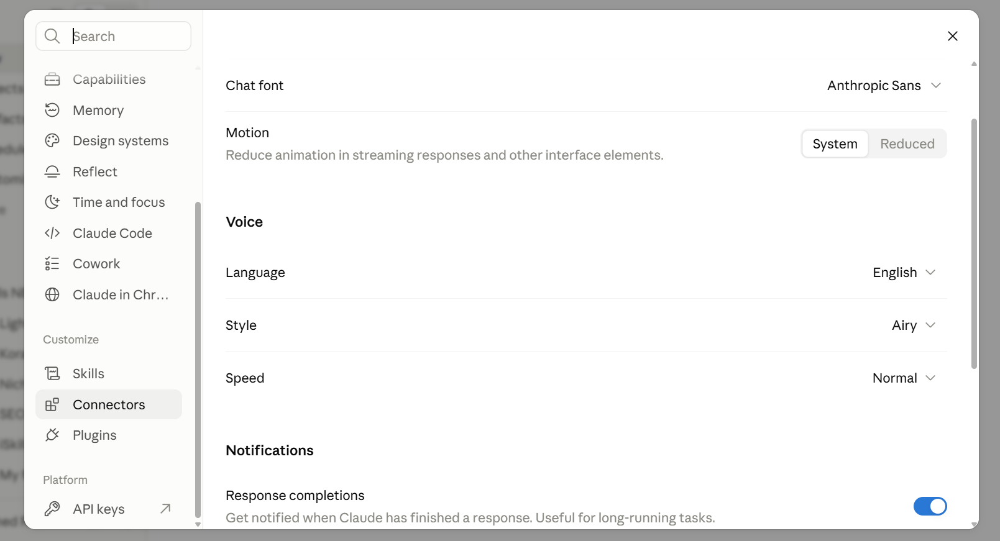
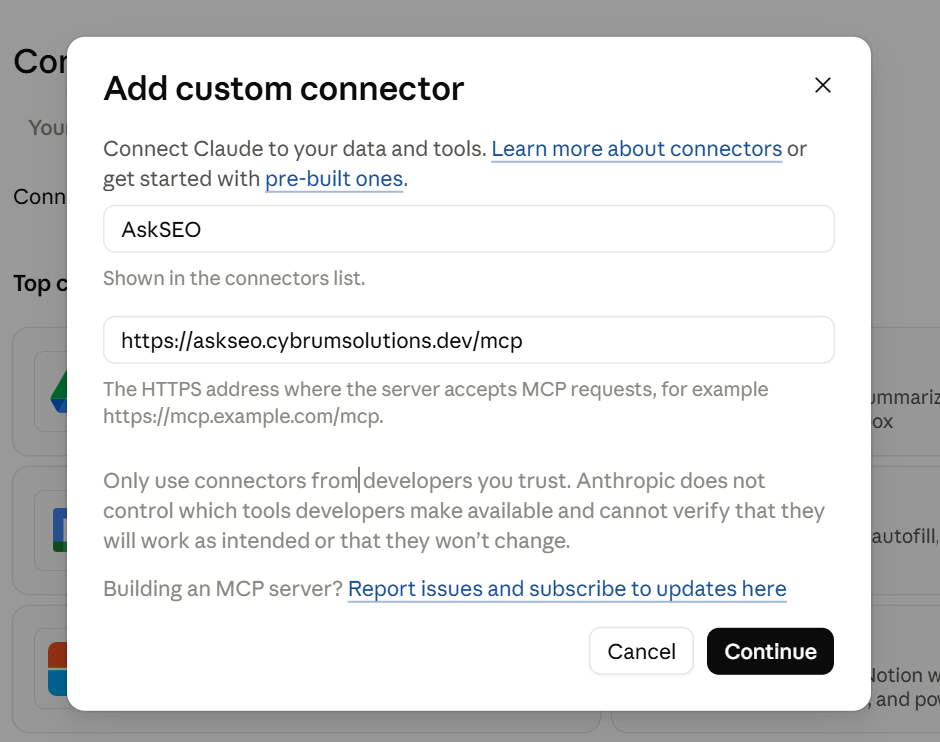
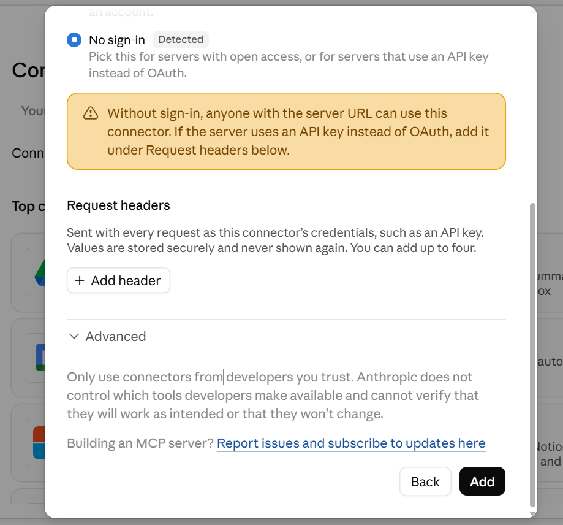
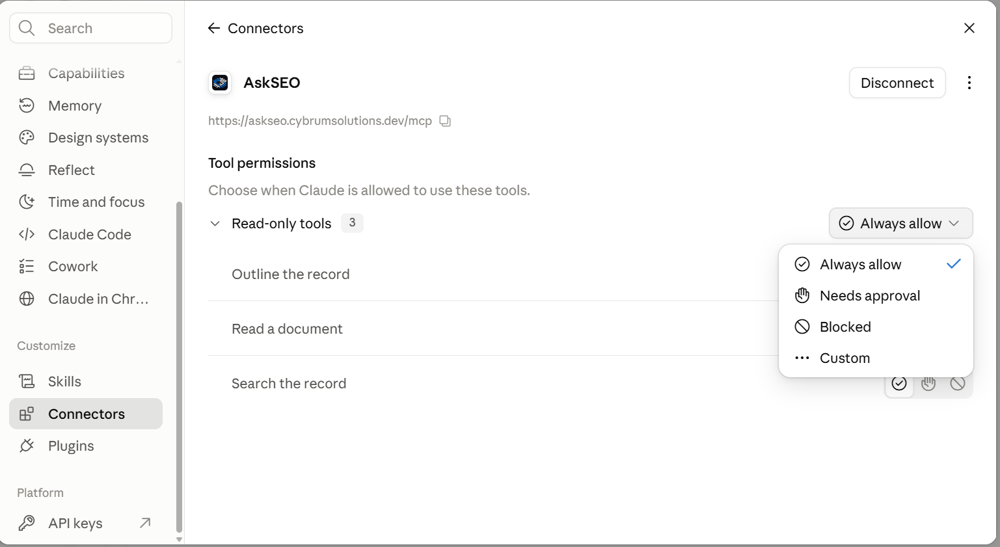
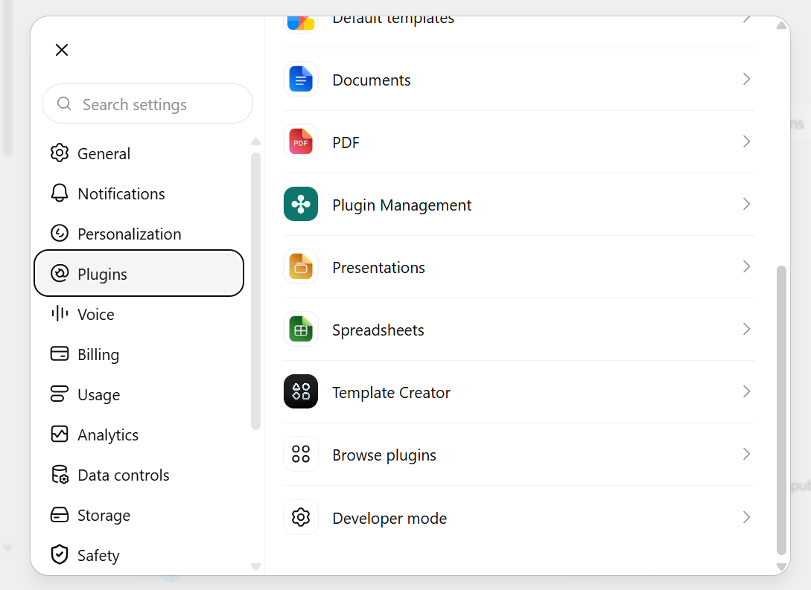
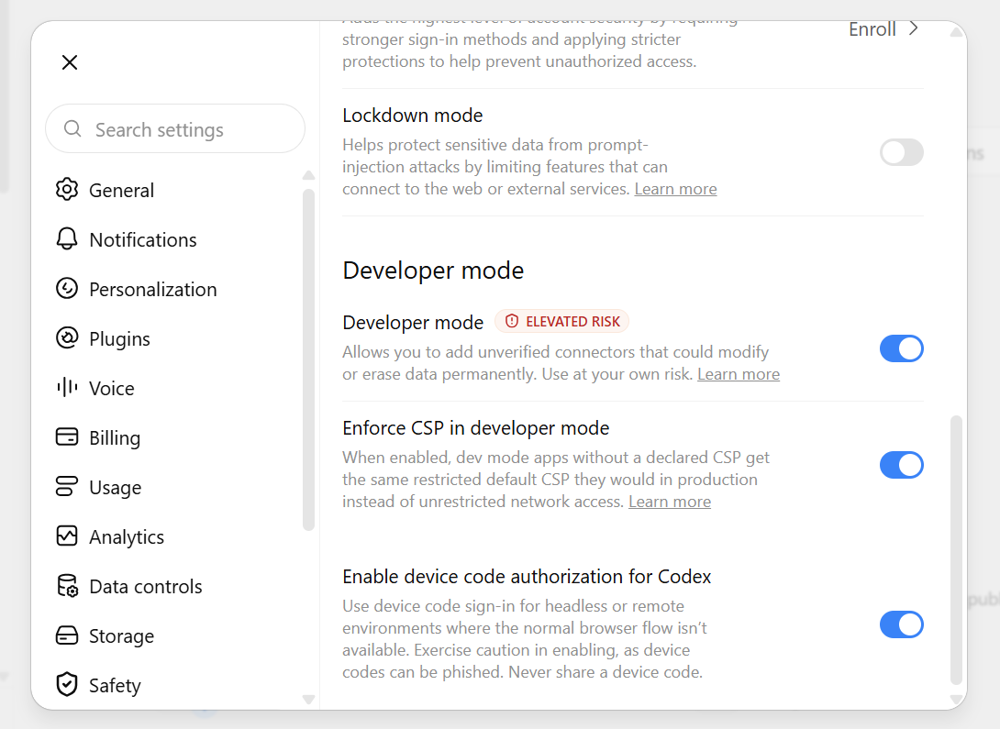
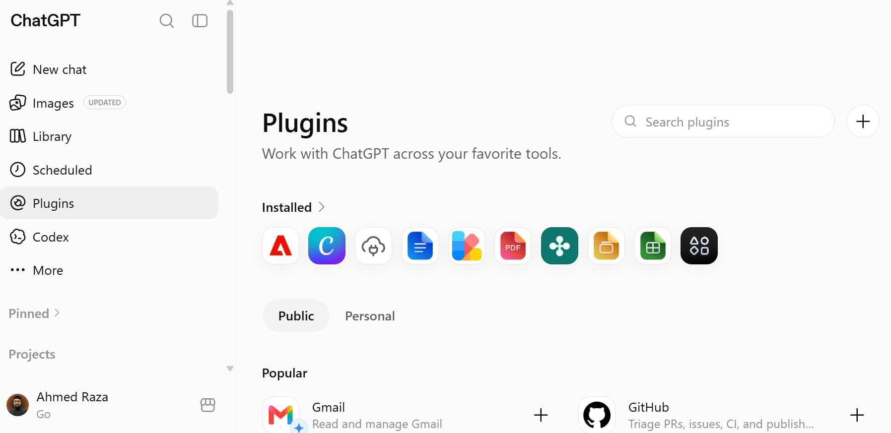
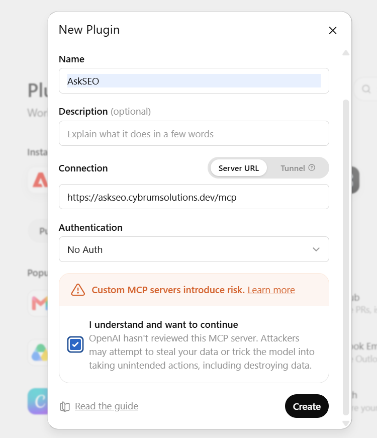
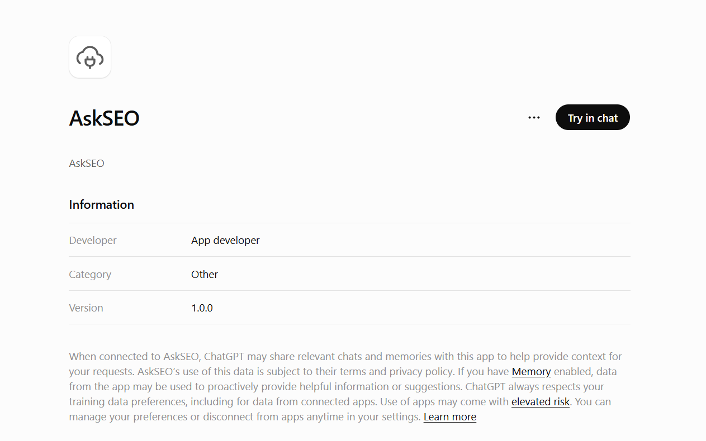

This record is served live over MCP. Connecting Claude or ChatGPT to it means either
one answers SEO questions strictly from what this record actually covers — niche
research, keyword research, on-page and technical SEO, off-page, local SEO, APK
sites, WordPress — citing the source document, or saying plainly when something
isn't covered yet, instead of guessing from general training data.

No login and no API key are needed to connect: this door is public and read-only.
Both setups below use the same two values —

- **Name:** AskSEO
- **MCP Server URL:** `https://askseo.cybrumsolutions.dev/mcp`

## Connect Claude

1. Open **Settings**, then **Connectors** — it sits under the **Customize** group in
   the sidebar.

   

2. Click **Add custom connector**, then paste the **Name** (`AskSEO`) and the
   **MCP Server URL** above. Click **Continue**.

   

3. On the next screen, Claude detects that this server needs **No sign-in** —
   leave that selected, leave **Request headers** empty, and leave **Advanced**
   alone. Click **Add**.

   > [!NOTE]
   > Claude shows a warning here — *"Without sign-in, anyone with the server URL
   > can use this connector."* That's expected: this record is public and
   > read-only by design, the same way its website is.

   

4. AskSEO now appears in your connectors list with its tools listed — **Outline
   the record**, **Read a document**, **Search the record**, all read-only. Set
   them to **Always allow** (or leave **Needs approval** if you'd rather confirm
   each use).

   

5. Ask it something and watch it answer from the record: *"Use AskSEO and
   explain what a nano niche is."*

## Connect ChatGPT

ChatGPT calls this **Plugins**, and it sits behind **Developer mode** — off by
default, since it lets ChatGPT add connectors OpenAI hasn't reviewed.

1. Open **Settings** and find **Developer mode** in the list.

   

2. Turn the **Developer mode** toggle on. ChatGPT marks it **elevated risk** —
   that's a general warning about unverified connectors, not specific to this
   one.

   

3. **Plugins** now appears in the main sidebar. Open it, then click the **+** in
   the top-right corner to add a new one.

   

4. In the **New Plugin** dialog: Name `AskSEO`, Connection set to **Server URL**
   (not Tunnel), paste the MCP Server URL, and set **Authentication** to
   **No Auth**. Check *"I understand and want to continue"* — the same generic
   custom-MCP-server warning Claude shows — then click **Create**.

   

5. Click **Try in chat** on AskSEO's plugin page, or enable it from the Plugins
   list inside any chat, then ask it a question the same way.

   

> [!NOTE]
> Developer mode and custom plugins are currently on ChatGPT's paid plans (Plus
> and above) — Free and the lower-cost Go plan may not show this option at all.
> This changes over time as OpenAI rolls it out further, so check your own
> Settings rather than assuming.

## What "grounded" means here

Both connectors point at the same read-only record. An agent connected this way
never receives write access, and it answers only from documents this record
actually admits to its machine surface — a draft or a withdrawn document is never
handed over as an answer.
