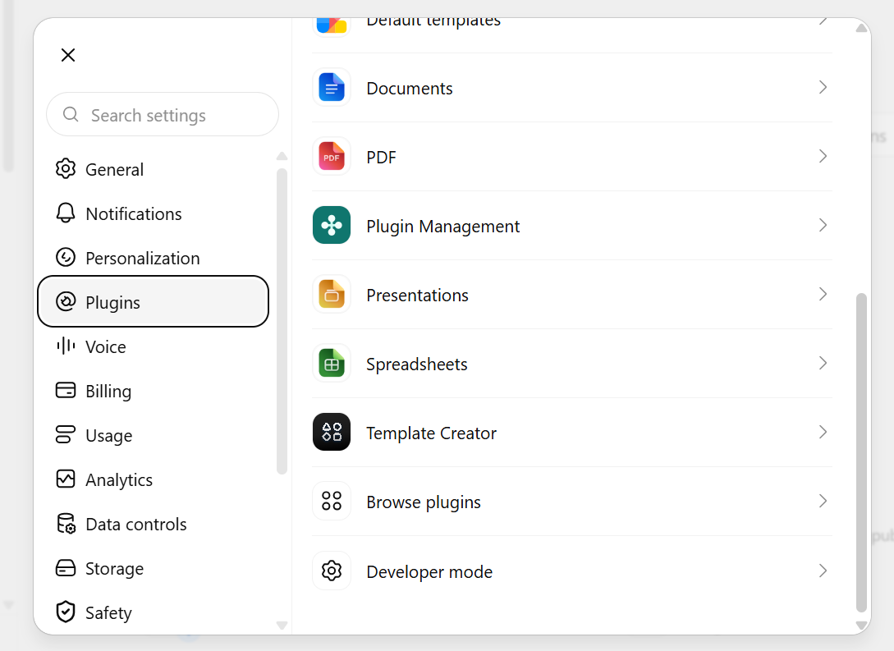
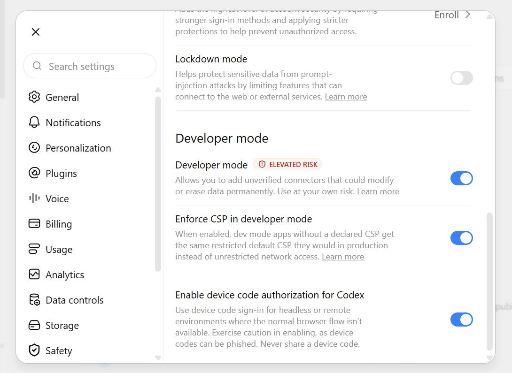
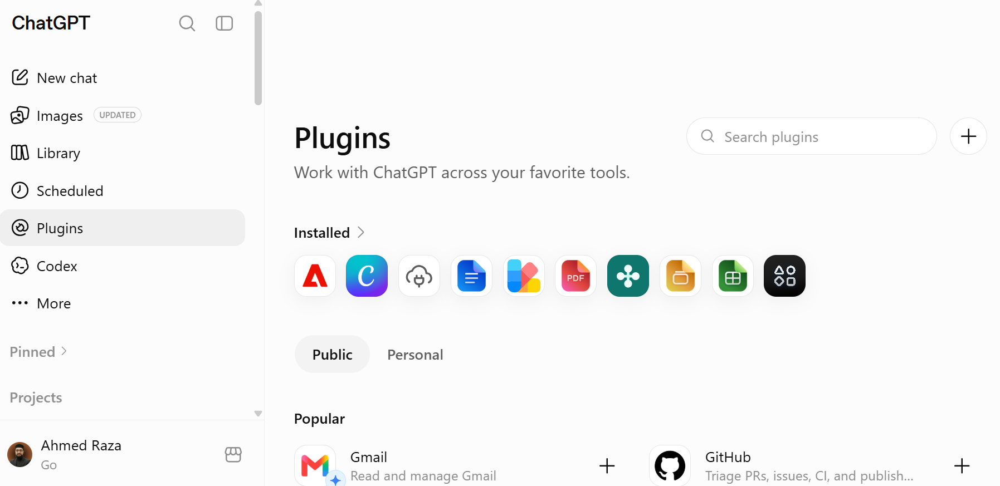
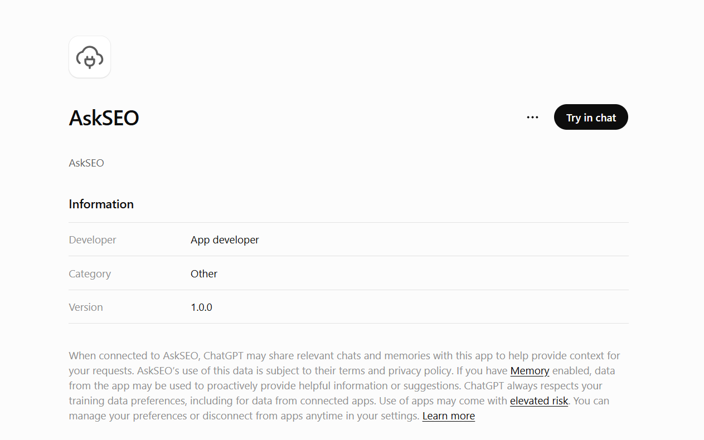

This record is served live over MCP. Connecting Claude, ChatGPT or Muse AI to it means each
one answers SEO questions strictly from what this record actually covers (niche
research, keyword research, on-page and technical SEO, off-page, local SEO, APK
sites, WordPress), citing the source document, or saying plainly when something
isn't covered yet, instead of guessing from general training data.

Connecting needs a free **AskSEO account**. The first time you connect, your
assistant opens AskSEO's sign-in page: sign in with **Google**, **GitHub**, or
your **email and password** (a new email account is confirmed with a 6-digit
code), then click **Allow**. That is all; no API key is needed. Every setup below
uses the same two values:

- **Name:** AskSEO
- **MCP Server URL:** `https://askseo.cybrumsolutions.dev/mcp`

## Connect Claude

1. Open **Settings**, then **Connectors** (it sits under the **Customize** group in
   the sidebar).
2. Click **Add custom connector**, then paste the **Name** (`AskSEO`) and the
   **MCP Server URL** above. Click **Continue**.
3. Claude detects that this server asks for sign-in. Do **not** choose
   **No sign-in**. Leave **Request headers** empty, and leave the OAuth
   **Client ID** and **Client Secret** under **Advanced** empty: Claude
   registers itself. Click **Add**, then **Connect**.
4. AskSEO's sign-in page opens in your browser. Sign in with Google, GitHub or
   your email (or create an account), then click **Allow** on the "Connect
   Claude to AskSEO" screen. You are sent back to Claude, and AskSEO emails you
   to confirm the connection.
5. AskSEO now appears in your connectors list with its three read-only tools:
   **Outline the record**, **Read a document** and **Search the record**. Set
   them to **Always allow** (or leave **Needs approval** if you'd rather confirm
   each use).
6. Ask it something and watch it answer from the record: *"Use AskSEO and
   explain what a nano niche is."*

## Connect ChatGPT

ChatGPT calls this **Plugins**, and it sits behind **Developer mode**, off by
default, since it lets ChatGPT add connectors OpenAI hasn't reviewed.

1. Open **Settings** and find **Developer mode** in the list.

   

2. Turn the **Developer mode** toggle on. ChatGPT marks it **elevated risk**:
   that's a general warning about unverified connectors, not specific to this
   one.

   

3. **Plugins** now appears in the main sidebar. Open it, then click the **+** in
   the top-right corner to add a new one.

   

4. In the **New Plugin** dialog: Name `AskSEO`, Connection set to **Server URL**
   (not Tunnel), paste the MCP Server URL, and set **Authentication** to
   **OAuth**. Check *"I understand and want to continue"* (the same generic
   custom-MCP-server warning Claude shows), then click **Create**.

5. ChatGPT opens AskSEO's sign-in page. Sign in (or create an account), then
   click **Allow**. You are sent back to ChatGPT.

6. Click **Try in chat** on AskSEO's plugin page, or enable it from the Plugins
   list inside any chat, then ask it a question the same way.

   

> [!NOTE]
> Developer mode and custom plugins are currently on ChatGPT's paid plans (Plus
> and above). Free and the lower-cost Go plan may not show this option at all.
> This changes over time as OpenAI rolls it out further, so check your own
> Settings rather than assuming.

## Connect Muse AI

Muse AI connects to the record by itself: give it the MCP Server URL and ask it
to add a custom MCP connector. Open a chat in Muse AI and send this prompt as it
is:

```text
Connect a custom MCP server for me.

Name: AskSEO
MCP Server URL: https://askseo.cybrumsolutions.dev/mcp

It uses OAuth sign-in: give me the sign-in link so I can sign in to my AskSEO
account and allow the connection. Once it is connected, list its tools. From then on, answer my SEO questions
with AskSEO's search tool, name the document each answer comes from, and tell
me plainly when the record does not cover a question instead of guessing.
```

Sign in on the page it opens and click **Allow**. When Muse AI confirms the
connector and lists its three tools (outline, read
and search), ask it something the same way: *"Use AskSEO and explain what a
nano niche is."*

## Connected before sign-in was required?

AskSEO used to work without an account, so a connector added before then was
saved as needing **no sign-in**. That saved setting does not change by itself:
reconnecting fails, and Claude shows an error like *"AskSEO is set up as not
requiring sign-in, but the server asked for sign-in when checked (status
401)."*

The fix is to add the connector again:

1. In **Settings**, then **Connectors**, open **AskSEO** and **remove** it.
2. Add it again with the same URL, following [Connect Claude](#connect-claude)
   above, and this time leave sign-in on.
3. Sign in and click **Allow**.

ChatGPT and Muse AI work the same way: remove the old AskSEO connector, then
add it again with sign-in (**OAuth** in ChatGPT).

## What "grounded" means here

Every connector points at the same read-only record. An agent connected this way
never receives write access, and it answers only from documents this record
actually admits to its machine surface: a draft or a withdrawn document is never
handed over as an answer.
